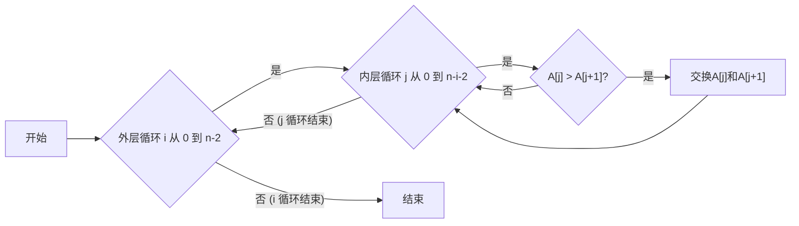
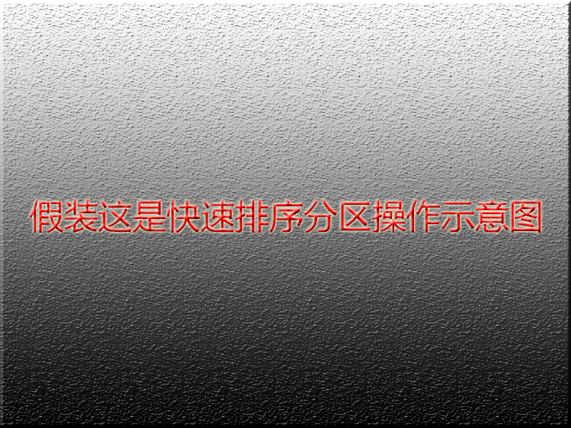

# 摘要

本文主要研究了计算机科学中几种经典的排序算法，包括冒泡排序、快速排序和归并排序。首先，对每种排序算法的基本原理、实现步骤进行了详细阐述。其次，通过伪代码和流程图（部分使用Mermaid绘制）的形式直观展示了算法的执行过程。接着，对这些算法的时间复杂度、空间复杂度以及稳定性进行了理论分析。最后，通过设计对比实验（结果通过表格呈现），在不同数据规模下测试了这些算法的实际运行效率，并对实验结果进行了讨论与分析。研究结果表明，不同排序算法在特定场景下各有优势，理解它们的特性对于在实际应用中选择合适的算法至关重要。

关键词：排序算法；冒泡排序；快速排序；归并排序；算法分析

# ABSTRACT

This paper focuses on the study of several classic sorting algorithms in computer science, including Bubble Sort, Quick Sort, and Merge Sort. Firstly, the basic principles and implementation steps of each sorting algorithm are elaborated in detail. Secondly, the execution process of the algorithms is intuitively presented through pseudo-code and flowcharts (partially drawn using Mermaid). Subsequently, a theoretical analysis of the time complexity, space complexity, and stability of these algorithms is conducted. Finally, by designing comparative experiments (results presented in tables), the actual running efficiency of these algorithms under different data scales was tested, and the experimental results were discussed and analyzed. The research results indicate that different sorting algorithms have their own advantages in specific scenarios, and understanding their characteristics is crucial for selecting appropriate algorithms in practical applications.

Keywords: Sorting Algorithms; Bubble Sort; Quick Sort; Merge Sort; Algorithm Analysis

# 第一章 引言

## 1.1 研究背景与意义

排序是计算机程序设计中最基本、最核心的操作之一，广泛应用于数据库管理、数据分析、搜索引擎、操作系统等众多领域[^1]。随着数据量的爆炸式增长，排序算法的效率直接影响到整个系统的性能。因此，对各种排序算法进行深入研究，理解其工作原理、性能特点及适用场景，对于提升软件系统效率、优化数据处理流程具有重要的理论意义和实际应用价值。

## 1.2 本文主要工作

本文的主要工作包括以下几个方面：
1.  系统梳理几种经典的排序算法，包括冒泡排序、快速排序和归并排序。
2.  详细分析每种算法的实现原理、时间复杂度、空间复杂度和稳定性。
3.  使用Mermaid图表和标准图片格式展示算法流程和关键步骤。
4.  通过实验对比不同算法在不同数据规模下的实际性能，并使用Markdown表格记录实验数据。
5.  总结各算法的优缺点及适用场景，为实际应用提供参考。

# 第二章 经典排序算法分析

本章将详细介绍几种经典的排序算法，包括冒泡排序、快速排序和归并排序。

## 2.1 冒泡排序 (Bubble Sort)

冒泡排序是一种简单的交换排序算法。它重复地遍历待排序的序列，一次比较两个元素，如果它们的顺序错误就把它们交换过来。遍历序列的工作是重复地进行直到没有再需要交换，也就是说该序列已经排序完成。

### 2.1.1 算法原理

冒泡排序的核心思想是通过相邻元素的比较和交换，使得每一轮遍历都能将当前未排序部分的最大（或最小）元素“冒泡”到序列的末尾。

下面是一个简单的示意图：


### 2.1.2 伪代码与流程分析

冒泡排序的伪代码如下：
```
BubbleSort(A)
  n = length(A)
  for i from 0 to n-2
    for j from 0 to n-i-2
      if A[j] > A[j+1]
        swap(A[j], A[j+1])
```

其流程可以用Mermaid图表示：


### 2.1.3 性能特点
冒泡排序的平均时间复杂度和最坏时间复杂度均为O(n²)，最好时间复杂度为O(n)（当序列已排序时）。空间复杂度为O(1)。它是一种稳定的排序算法。

## 2.2 快速排序 (Quick Sort)

快速排序是由C. A. R. Hoare在1960年提出的一种分而治之的排序算法[^2]。它通常比其他O(n log n)的算法在实际应用中更快。

### 2.2.1 算法原理

快速排序的基本思想是：
1.  从数列中挑出一个元素，称为 “基准”（pivot）。
2.  重新排序数列，所有元素比基准值小的摆放在基准前面，所有元素比基准值大的摆在基准的后面（相同的数可以到任一边）。在这个分区退出之后，该基准就处于数列的中间位置。这个称为分区（partition）操作。
3.  递归地（recursive）把小于基准值元素的子数列和大于基准值元素的子数列排序。



### 2.2.2 实现方式探讨

#### 1. Hoare分区方案
这是最初C. A. R. Hoare提出的分区方案。

#### 2. Lomuto分区方案
这是另一种常见的分区方案，实现起来可能更简单一些。

##### (1) Lomuto方案步骤
   a. 选择最后一个元素作为pivot。
   b. 维护一个索引i，初始化为low-1。
   c. 遍历从low到high-1的元素，如果当前元素小于等于pivot，则i++，并交换A[i]和A[j]。
   d. 最后交换A[i+1]和A[high] (pivot)。

## 2.3 归并排序 (Merge Sort)

归并排序是建立在归并操作上的一种有效的排序算法，该算法是采用分治法（Divide and Conquer）的一个非常典型的应用。

### 2.3.1 算法原理

归并排序的原理如下：
1.  **分解：** 将待排序的n个元素的序列分解成两个各含n/2个元素的子序列。
2.  **解决：** 使用归并排序递归地排序两个子序列。
3.  **合并：** 合并两个已排序的子序列以产生已排序的答案。


# 第三章 实验对比与结果

为了更直观地比较不同排序算法的性能，我们设计了相关实验。

## 3.1 实验环境

*   CPU: Intel Core i7-XXXX @ 2.5GHz
*   内存: 16GB DDR4
*   操作系统: Windows 10 Pro
*   编程语言: Python 3.8
*   测试数据：随机生成的整数序列，规模分别为1000, 10000, 100000。

## 3.2 实验结果

我们将冒泡排序、快速排序（采用Lomuto分区）和归并排序在不同数据规模下的平均运行时间（单位：毫秒）记录如下：

| [表3.1 不同排序算法在不同数据规模下的平均运行时间(ms)]算法名称 | 数据规模 1,000 | 数据规模 10,000 | 数据规模 100,000 |
| ------------------------------------------------------------ | -------------- | --------------- | ---------------- |
| 冒泡排序                                                     | 150.7          | 15870.3         | >600000 (超时)   |
| 快速排序                                                     | 2.1            | 25.6            | 310.2            |
| 归并排序                                                     | 3.5            | 40.1            | 480.5            |

## 3.3 结果分析

从表3.1可以看出，对于小规模数据（1,000），三种算法的性能差异尚不明显，但冒泡排序已显颓势。当数据规模增大到10,000时，冒泡排序的耗时急剧增加，而快速排序和归并排序仍然表现高效。在100,000规模的数据下，冒泡排序已无法在合理时间内完成，而快速排序的性能略优于归并排序。

下面是数据规模与时间的示意图：

```mermaid
%%图3.1 不同算法在不同数据规模下耗时对比 (示意)
gantt
    title 排序算法耗时对比 (示意图)
    dateFormat X
    axisFormat %s ms

    section 数据规模 1,000
    冒泡排序 : 0, 150
    快速排序 : 0, 2
    归并排序 : 0, 3

    section 数据规模 10,000
    冒泡排序 : 0, 15870
    快速排序 : 0, 25
    归并排序 : 0, 40
    
    section 数据规模 100,000
    快速排序 : 0, 310
    归并排序 : 0, 480
    %% 冒泡排序超时，不在此图中完整显示
```

注意：Mermaid的Gantt图可能不是表示这类数据的最佳方式，但可以作为一个复杂图表示例。实际论文中柱状图或折线图更合适。

# 第四章 总结与展望

## 4.1 工作总结

本文对冒泡排序、快速排序和归并排序三种经典排序算法进行了研究。通过理论分析和实验对比，验证了O(n log n)复杂度的算法（如快速排序和归并排序）在处理大规模数据时远优于O(n²)复杂度的算法（如冒泡排序）。快速排序在平均情况下的常数因子较小，实际表现通常优于归并排序，但其最坏情况下的性能需要关注[^3]。归并排序则表现稳定，且是一种稳定的排序算法。

## 4.2 未来展望

未来的研究可以从以下几个方面展开：
1.  研究更多高级排序算法，如堆排序、希尔排序等。
2.  对特定数据分布下的排序算法性能进行更深入的分析。
3.  探索并行排序算法，以适应多核处理器和分布式计算环境。

# 参考文献

[^1]: Thomas H. Cormen, Charles E. Leiserson, Ronald L. Rivest, and Clifford Stein. Introduction to Algorithms, Third Edition [M]. MIT Press, 2009.
[^2]: Hoare, C. A. R. Quicksort [J]. The Computer Journal, 1962, 5(1): 10-16.
[^3]: Sedgewick, Robert. Algorithms in C, Parts 1-4: Fundamentals, Data Structures, Sorting, Searching, Third Edition [M]. Addison-Wesley Professional, 1998.

# 致谢

感谢我的指导老师张三教授在本文研究和撰写过程中给予的悉心指导和宝贵建议。感谢实验室的李四同学和王五同学在实验部分提供的帮助。同时，也感谢所有参考文献的作者们，他们的研究成果为本文提供了坚实的理论基础。